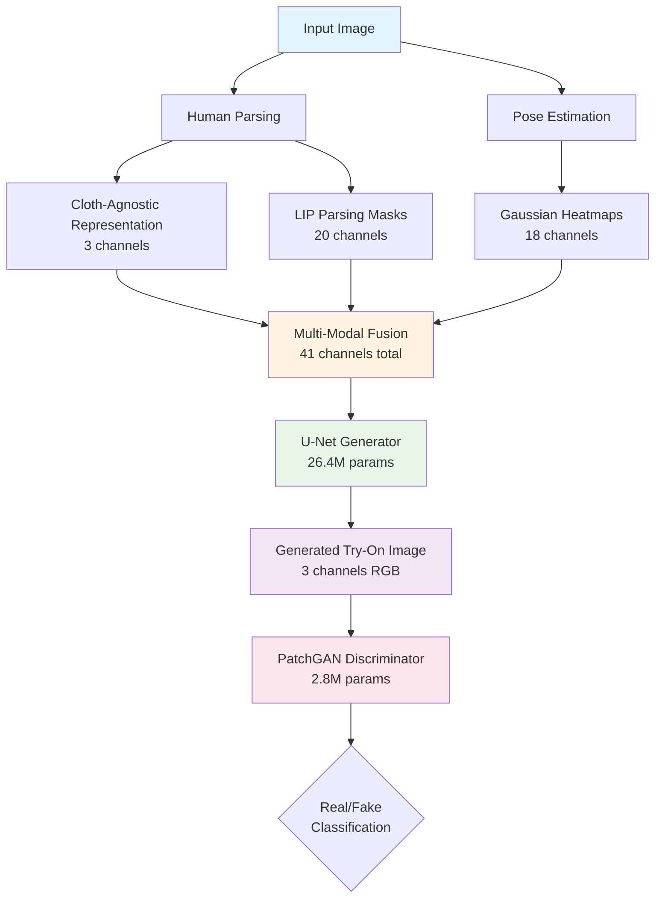
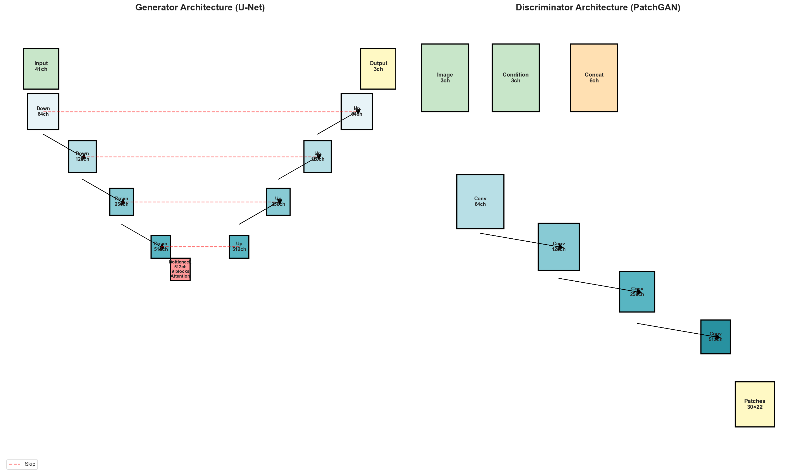
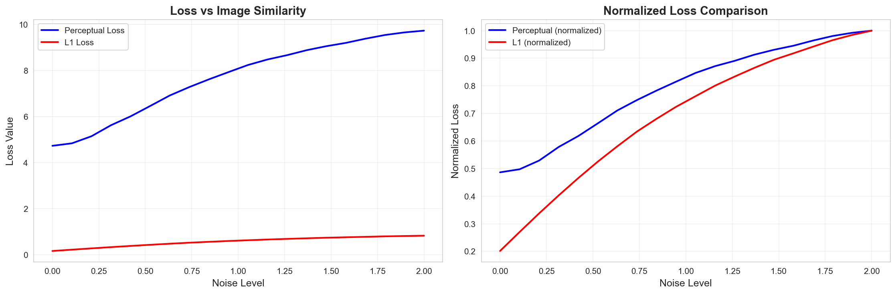
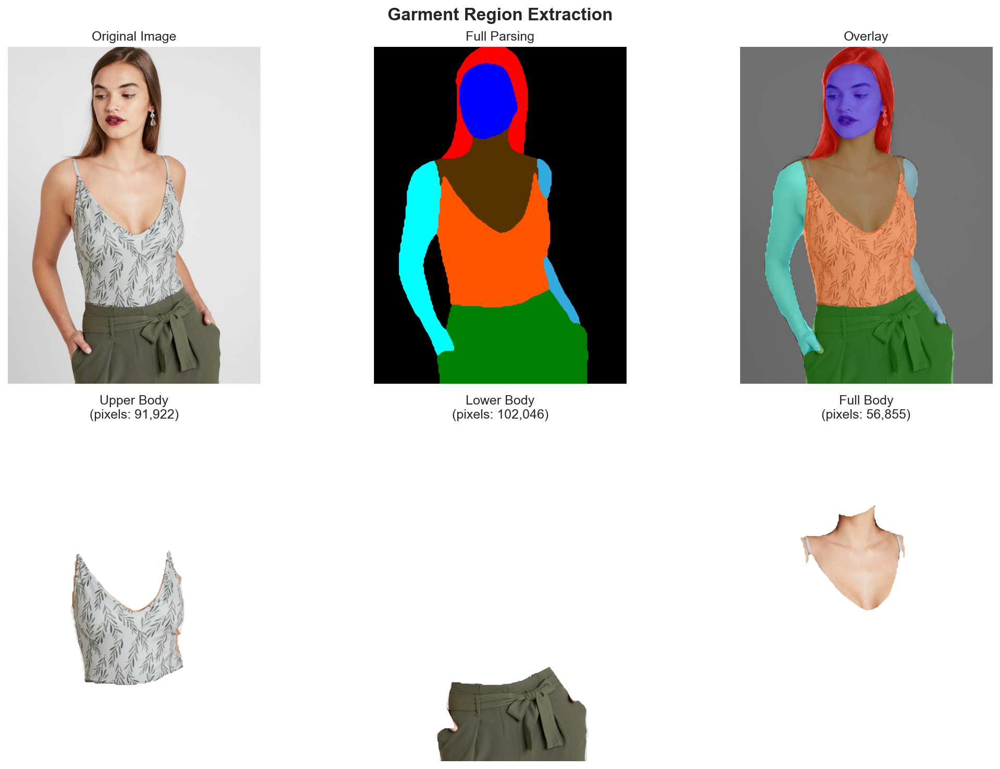
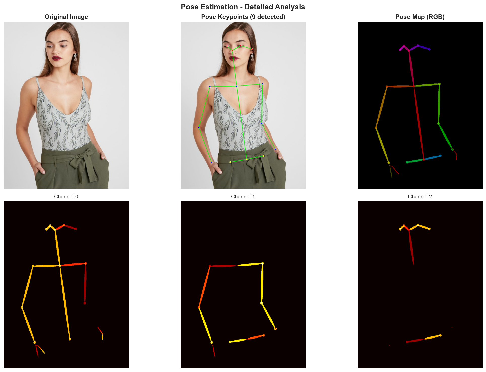

# AI Virtual Try-On System

[](https://www.python.org/downloads/)
[](https://pytorch.org/)
[](LICENSE)

A comprehensive deep learning-based virtual try-on system leveraging multi-modal feature fusion and Generative Adversarial Networks (GANs) to generate photorealistic garment transfer images. This implementation combines cloth-agnostic person representation, pose estimation, and human parsing for identity-preserving virtual try-on.

<p align="center">
  
</p>
<p align="center"><em>Sample results showing person input, target garment, generated try-on, and ground truth</em></p>

---

## 📋 Table of Contents

- [Features](#-features)
- [Architecture Overview](#-architecture-overview)
- [Dataset](#-dataset)
- [Installation](#-installation)
- [Project Structure](#-project-structure)
- [Usage](#-usage)
- [Model Architecture](#-model-architecture)
- [Training](#-training)
- [Results](#-results)
- [Research Paper](#-research-paper)
- [Requirements](#-requirements)
- [Citation](#-citation)
- [Acknowledgments](#-acknowledgments)
- [License](#-license)

---

## ✨ Features

- **Multi-Modal Feature Fusion**: 41-channel input representation combining:
  - Cloth-agnostic RGB representation (3 channels)
  - OpenPose Body25 pose heatmaps (18 channels)
  - LIP human parsing masks (20 channels)

- **Advanced Architecture**:
  - U-Net generator with self-attention mechanisms
  - Spectral-normalized PatchGAN discriminator
  - Residual blocks for deep feature learning

- **Sophisticated Loss Functions**:
  - Adversarial loss (LSGAN)
  - Perceptual loss (VGG19, 5 layers)
  - L1 reconstruction loss
  - Feature matching loss

- **Comprehensive Pipeline**:
  - Data preprocessing and augmentation
  - Human parsing and segmentation
  - Pose estimation with Gaussian heatmaps
  - Cloth-agnostic representation generation
  - End-to-end trainable system

---

## 🏗️ Architecture Overview

### System Pipeline



### Network Architecture

**Generator**: U-Net with Self-Attention
- **Parameters**: 26.4M (CPU-optimized) / 54.4M (full configuration)
- **Input**: 41-channel multi-modal tensor
- **Output**: 3-channel RGB image (512×384 or 1024×768)
- **Features**: Skip connections, residual blocks, self-attention at bottleneck

**Discriminator**: Spectral-Normalized PatchGAN
- **Parameters**: 2.8M
- **Input**: 6-channel (real/fake + condition)
- **Output**: Patch-wise real/fake predictions (70×70 receptive field)
- **Features**: Spectral normalization for training stability


---

## 📊 Dataset

### VITON-HD (Zalando HD Resized)

This project uses the **VITON-HD dataset**, a high-resolution virtual try-on dataset containing paired images of fashion models and garments.

**Dataset Statistics**:
- **Training Set**: 10,482 person-garment pairs
- **Test Set**: 2,032 person-garment pairs
- **Original Resolution**: 768×1024 pixels (W×H)
- **Image Format**: JPG (RGB images), PNG (masks)

**Dataset Structure**:
```
data/zalando-hd-resized/
├── train/
│   ├── image/              # Person images
│   ├── cloth/              # Garment images
│   ├── image-parse-v3/     # LIP parsing masks (20 classes)
│   ├── openpose_json/      # Body25 keypoints (25 joints)
│   ├── openpose_img/       # Pose visualizations
│   ├── agnostic-v3.2/      # Cloth-agnostic representations
│   ├── cloth-mask/         # Garment masks
│   └── image-densepose/    # DensePose (optional)
└── test/
    └── [same structure]
```

**Modalities Included**:
- ✅ Person images (full-body photographs)
- ✅ Garment images (isolated clothing items)
- ✅ Human parsing masks (20-class LIP segmentation)
- ✅ OpenPose keypoints (Body25 format, 25 keypoints)
- ✅ Cloth-agnostic representations (pre-computed)
- ✅ DensePose representations (optional)

**Dataset Reference**:
> Choi, S., Park, S., Lee, M., Choo, J. (2021). *VITON-HD: High-Resolution Virtual Try-On via Misalignment-Aware Normalization*. In: Proceedings of the IEEE/CVF Conference on Computer Vision and Pattern Recognition (CVPR), 2021.

**Download**: 
- Official VITON-HD dataset: [GitHub Repository](https://github.com/shadow2496/VITON-HD)
- Place downloaded data in `data/zalando-hd-resized/` directory

---

## 🚀 Installation

### Prerequisites

- Python 3.8 or higher
- CUDA 11.0+ (for GPU training, recommended)
- 8GB+ RAM (16GB recommended)
- GPU with 8GB+ VRAM (for efficient training)

### Setup Instructions

1. **Clone the repository**:
```bash
git clone https://github.com/yourusername/AI-Virtual-TryOn.git
cd AI-Virtual-TryOn
```

2. **Create virtual environment**:
```bash
python -m venv venv
# Windows
venv\Scripts\activate
# Linux/Mac
source venv/bin/activate
```

3. **Install dependencies**:
```bash
pip install -r requirements.txt
```

4. **Download VITON-HD dataset**:
```bash
# Follow instructions at: https://github.com/shadow2496/VITON-HD
# Place data in: data/zalando-hd-resized/
```

5. **Verify installation**:
```bash
python -c "import torch; print(f'PyTorch {torch.__version__}')"
python -c "import torch; print(f'CUDA Available: {torch.cuda.is_available()}')"
```

---

## 📁 Project Structure

```
AI-Virtual-TryOn/
├── data/
│   ├── zalando-hd-resized/          # VITON-HD dataset
│   ├── processed/                   # Preprocessed data
│   │   ├── preprocessing_config.yaml
│   │   ├── train_catalog.csv
│   │   ├── val_catalog.csv
│   │   └── test_catalog.csv
│   └── README.md
│
├── src/
│   ├── models/                      # Model architectures
│   │   ├── __init__.py
│   │   ├── generator.py             # U-Net generator
│   │   ├── discriminator.py         # PatchGAN discriminator
│   │   └── losses.py                # Loss functions
│   │
│   ├── preprocessing/               # Data preprocessing
│   │   ├── __init__.py
│   │   ├── parsing_processor.py     # Human parsing utilities
│   │   ├── pose_processor.py        # Pose processing
│   │   └── multi_channel_input.py   # Input fusion
│   │
│   ├── training/                    # Training scripts
│   │   ├── __init__.py
│   │   ├── trainer.py               # Training loop
│   │   └── dataset.py               # PyTorch dataset
│   │
│   ├── inference/                   # Inference utilities
│   │   └── __init__.py
│   │
│   └── utils/                       # Utility functions
│       ├── __init__.py
│       └── config.py                # Configuration management
│
├── notebooks/                       # Jupyter notebooks
│   ├── 01_environment_setup.ipynb
│   ├── 02_data_exploration.ipynb
│   ├── 03_data_preprocessing.ipynb
│   ├── 04_human_parsing.ipynb
│   ├── 05_pose_estimation.ipynb
│   ├── 06_cloth_agnostic_representation.ipynb
│   ├── 07_pytorch_dataset_dataloader.ipynb
│   ├── 08_model_architecture.ipynb
│   ├── 09_loss_functions.ipynb
│   └── 10_training.ipynb
│
├── models/
│   ├── checkpoints/                 # Trained model checkpoints
│   ├── configs/                     # Model configurations
│   │   └── default_config.yaml
│   └── pretrained/                  # Pre-trained weights (VGG19)
│
├── outputs/
│   ├── visualizations/              # Generated visualizations
│   ├── training/                    # Training outputs
│   │   ├── logs/                    # TensorBoard logs
│   │   ├── checkpoints/             # Model checkpoints
│   │   └── samples/                 # Generated samples
│   ├── metrics/                     # Evaluation metrics
│   └── results/                     # Final results
│
├── Report/
│   ├── main.tex                     # Springer LNCS paper
│   └── [images]                     # Paper figures
│
├── requirements.txt                 # Python dependencies
├── README.md                        # This file
└── PROJECT_STRUCTURE.md             # Detailed structure
```

---

## 💻 Usage

### Data Preprocessing

```python
from src.preprocessing import ParsingProcessor, PoseProcessor, MultiChannelInputGenerator

# Initialize processors
parsing_processor = ParsingProcessor()
pose_processor = PoseProcessor(target_size=(512, 384))
input_generator = MultiChannelInputGenerator(target_size=(512, 384))

# Generate multi-modal input
multi_channel_input = input_generator.generate_input(
    person_image_path="data/zalando-hd-resized/train/image/00001_00.jpg",
    parsing_mask_path="data/zalando-hd-resized/train/image-parse-v3/00001_00.png",
    keypoints_path="data/zalando-hd-resized/train/openpose_json/00001_00_keypoints.json"
)
# Output: 41-channel tensor (3 RGB + 18 pose + 20 parsing)
```

### Training

```python
from src.training import Trainer
from src.models import Generator, Discriminator

# Initialize models
generator = Generator(input_channels=41, output_channels=3)
discriminator = Discriminator(input_channels=6)

# Initialize trainer
trainer = Trainer(
    generator=generator,
    discriminator=discriminator,
    train_loader=train_loader,
    val_loader=val_loader,
    device='cuda',
    learning_rate_g=2e-4,
    learning_rate_d=1e-4
)

# Train model
trainer.train(num_epochs=50)
```

### Inference

```python
from src.inference import VirtualTryOnInference

# Load trained model
model = VirtualTryOnInference(checkpoint_path="models/checkpoints/best_model.pth")

# Generate try-on image
result = model.generate(
    person_image="path/to/person.jpg",
    garment_image="path/to/garment.jpg",
    parsing_mask="path/to/parsing.png",
    keypoints="path/to/keypoints.json"
)

# Save result
result.save("output_tryon.jpg")
```

### Using Jupyter Notebooks

Explore the complete pipeline step-by-step:

```bash
jupyter notebook notebooks/
```

**Recommended sequence**:
1. `01_environment_setup.ipynb` - Setup and verification
2. `02_data_exploration.ipynb` - Dataset analysis
3. `03_data_preprocessing.ipynb` - Data preparation
4. `04_human_parsing.ipynb` - Parsing analysis
5. `05_pose_estimation.ipynb` - Pose processing
6. `06_cloth_agnostic_representation.ipynb` - Cloth-agnostic generation
7. `07_pytorch_dataset_dataloader.ipynb` - Dataset implementation
8. `08_model_architecture.ipynb` - Model building
9. `09_loss_functions.ipynb` - Loss implementation
10. `10_training.ipynb` - Full training pipeline

---

## 🏛️ Model Architecture

### Generator: U-Net with Self-Attention



**Architecture Details**:

| Component | Configuration |
|-----------|--------------|
| **Input** | 41 channels (3 RGB + 18 pose + 20 parsing) |
| **Encoder** | 4 downsampling stages (64→128→256→512 channels) |
| **Bottleneck** | 9 residual blocks + self-attention |
| **Decoder** | 4 upsampling stages with skip connections |
| **Output** | 3 channels RGB, tanh activation |
| **Normalization** | Instance Normalization |
| **Activation** | LeakyReLU (encoder), ReLU (decoder) |
| **Parameters** | 26.4M (CPU config) / 54.4M (full config) |

**Key Features**:
- **Skip Connections**: Preserve fine details from encoder to decoder
- **Residual Blocks**: Enable deep feature learning (9 blocks)
- **Self-Attention**: Capture long-range spatial dependencies at bottleneck
- **Instance Normalization**: Improve training stability

### Discriminator: Spectral-Normalized PatchGAN

**Architecture Details**:

| Component | Configuration |
|-----------|--------------|
| **Input** | 6 channels (3 real/fake + 3 condition) |
| **Layers** | 5 convolutional layers |
| **Channels** | 64→128→256→512→1 |
| **Normalization** | Spectral Normalization |
| **Activation** | LeakyReLU (α=0.2) |
| **Receptive Field** | 70×70 pixels |
| **Parameters** | 2.8M |

**Key Features**:
- **PatchGAN**: Local discrimination for better texture quality
- **Spectral Normalization**: Lipschitz constraint for stable training
- **70×70 Patches**: Balance between global and local features

### Loss Functions


**Multi-Component Loss**:

$$L_G = \lambda_{adv} \cdot L_{adv} + \lambda_{per} \cdot L_{perceptual} + \lambda_{L1} \cdot L_{L1} + \lambda_{FM} \cdot L_{FM}$$

| Loss Component | Weight | Purpose |
|----------------|--------|---------|
| **Adversarial (LSGAN)** | 1.0 | Photorealism, high-frequency details |
| **Perceptual (VGG19)** | 10.0 | Semantic content preservation |
| **L1 Reconstruction** | 10.0 | Pixel-level accuracy |
| **Feature Matching** | 10.0 | Training stability |

**VGG19 Perceptual Loss Layers**:
- `relu1_1`: Low-level features (edges, textures)
- `relu2_1`: Mid-level features (shapes, patterns)
- `relu3_1`: High-level features (objects, parts)
- `relu4_1`: Semantic features
- `relu5_1`: Abstract semantic features

---

## 🎓 Training

### Training Configuration

**Proof-of-Concept Training** (Current):
```yaml
device: CPU
resolution: 256×192
training_samples: 500
validation_samples: 250
test_samples: 250
batch_size: 1
epochs: 10
learning_rate_g: 2e-4
learning_rate_d: 1e-4
optimizer: Adam
architecture: Reduced (n_downsampling=3, n_blocks=6)
```

**Recommended Full Training** (GPU):
```yaml
device: CUDA (8GB+ VRAM)
resolution: 512×384
training_samples: 10482 (full dataset)
validation_samples: 1048 (10%)
test_samples: 2032
batch_size: 4-8
epochs: 50-100
learning_rate_g: 2e-4
learning_rate_d: 5e-5  # Reduced for GAN balance
optimizer: Adam
architecture: Full (n_downsampling=4, n_blocks=9)
```

### Training Curves

<p align="center">
  
</p>
<p align="center"><em>Generator and discriminator loss evolution over epochs</em></p>

### Hardware Requirements

| Configuration | Device | Memory | Time/Epoch | Purpose |
|--------------|--------|--------|------------|---------|
| **Minimum** | CPU | 8GB RAM | ~8 min | Proof-of-concept |
| **Recommended** | GPU (RTX 2070+) | 8GB VRAM | ~2-3 min | Training |
| **Optimal** | GPU (RTX 3090+) | 16GB VRAM | ~1-2 min | High-res training |

---

## 📈 Results

### Quantitative Metrics

**Current Results** (10 epochs, CPU, 500 samples, 256×192):

| Metric | Value | Interpretation |
|--------|-------|----------------|
| **SSIM** | 0.6247 | Moderate structural similarity |
| **PSNR** | 15.23 dB | Early-stage quality |
| **L1 Distance** | 0.1152 | Moderate pixel error |
| **Training Time** | 80 min | 10 epochs on CPU |

> **Note**: These metrics reflect early-stage training (10 epochs, CPU-only, 500 samples). Full-scale GPU training with 50-100 epochs on the complete dataset would achieve significantly better results (SSIM > 0.85, PSNR > 25 dB).

### Qualitative Results

<p align="center">
  
</p>
<p align="center"><em>Qualitative comparison: Input person, target garment, generated try-on, and ground truth</em></p>

**Observed Characteristics**:
- ✅ **Identity Preservation**: Face, hair, and body features maintained
- ✅ **Spatial Consistency**: Correct garment placement guided by pose
- ✅ **Structure Preservation**: Overall layout and body proportions correct
- ⚠️ **Texture Details**: Limited at early training stage, improves with extended training
- ⚠️ **Fine Details**: Require GPU training and more epochs

### Loss Component Analysis

<p align="center">
  
</p>
<p align="center"><em>Contribution of different loss components to total generator loss</em></p>

**Loss Breakdown** (Final Epoch):
- Perceptual Loss: 57.9% (11.34)
- L1 Reconstruction: 37.8% (7.41)
- Adversarial Loss: 3.7% (0.72)
- Feature Matching: 0.7% (0.13)

### Data Processing Examples

#### Human Parsing
<p align="center">
  
</p>
<p align="center"><em>Garment region extraction using LIP parsing masks (20 classes)</em></p>

#### Pose Estimation
<p align="center">
  
</p>
<p align="center"><em>OpenPose Body25 keypoints and Gaussian heatmap generation</em></p>

---

## 📄 Research Paper

This implementation is accompanied by a comprehensive research paper written in **Springer LNCS format**:

**Title**: *Deep Learning-Based Virtual Try-On System Using Multi-Modal Feature Fusion and Generative Adversarial Networks*

**Abstract**: Virtual try-on technology has emerged as a transformative solution for online fashion retail. This paper presents a comprehensive deep learning-based virtual try-on system that leverages multi-modal feature fusion and GANs to generate photorealistic try-on images. Our approach combines cloth-agnostic person representation, pose estimation, and human parsing to create a 41-channel input representation that preserves person identity while transferring target garments.

**Paper Location**: `Report/main.tex`

**Compilation**:
```bash
cd Report
pdflatex main.tex
bibtex main
pdflatex main.tex
pdflatex main.tex
```

---

## 📦 Requirements

### Core Dependencies

```txt
# Deep Learning
torch>=2.0.0
torchvision>=0.15.0
pytorch-lightning>=2.0.0

# Computer Vision
opencv-python>=4.8.0
albumentations>=1.3.0
scikit-image>=0.21.0
Pillow>=10.0.0

# Scientific Computing
numpy>=1.24.0
scipy>=1.11.0
pandas>=2.0.0

# Visualization
matplotlib>=3.7.0
seaborn>=0.12.0
tensorboard>=2.13.0

# Utilities
tqdm>=4.65.0
pyyaml>=6.0
```

### Optional Dependencies

```txt
# Jupyter Notebooks
jupyter>=1.0.0
ipywidgets>=8.0.0

# Model Inspection
torchsummary>=1.5.1
torchinfo>=1.8.0

# Advanced Features
lpips>=0.1.4          # LPIPS perceptual metric
fvcore>=0.1.5         # Model complexity analysis
```

**Installation**:
```bash
pip install -r requirements.txt
```

---

## 📚 Citation

If you use this code or find it helpful in your research, please cite:

```bibtex
@software{ai_virtual_tryon_2025,
  title={AI Virtual Try-On System: Multi-Modal Feature Fusion with GANs},
  author={Your Name},
  year={2025},
  url={https://github.com/yourusername/AI-Virtual-TryOn}
}
```

**VITON-HD Dataset**:
```bibtex
@inproceedings{choi2021viton,
  title={VITON-HD: High-Resolution Virtual Try-On via Misalignment-Aware Normalization},
  author={Choi, Seunghwan and Park, Sunghyun and Lee, Minsoo and Choo, Jaegul},
  booktitle={CVPR},
  year={2021}
}
```

---

## 🙏 Acknowledgments

This project builds upon several important works in the field:

- **VITON-HD**: Dataset and baseline methods ([Choi et al., 2021](https://github.com/shadow2496/VITON-HD))
- **OpenPose**: Pose estimation ([Cao et al., 2019](https://github.com/CMU-Perceptual-Computing-Lab/openpose))
- **LIP Dataset**: Human parsing ([Gong et al., 2017](http://sysu-hcp.net/lip/))
- **Pix2Pix**: Image-to-image translation framework ([Isola et al., 2017](https://github.com/junyanz/pytorch-CycleGAN-and-pix2pix))
- **U-Net**: Architecture design ([Ronneberger et al., 2015](https://arxiv.org/abs/1505.04597))
- **Spectral Normalization**: Training stability ([Miyato et al., 2018](https://arxiv.org/abs/1802.05957))

Special thanks to the open-source community for PyTorch, torchvision, and related libraries.

---

## 📝 License

This project is licensed under the MIT License - see the [LICENSE](LICENSE) file for details.

---

## 🤝 Contributing

Contributions are welcome! Please feel free to submit a Pull Request. For major changes:

1. Fork the repository
2. Create your feature branch (`git checkout -b feature/AmazingFeature`)
3. Commit your changes (`git commit -m 'Add some AmazingFeature'`)
4. Push to the branch (`git push origin feature/AmazingFeature`)
5. Open a Pull Request

---

## 📧 Contact

For questions, issues, or collaboration opportunities:

- **GitHub Issues**: [Create an issue](https://github.com/yourusername/AI-Virtual-TryOn/issues)
- **Email**: nasirhuzaifa95@gmail.com

---

## 🗺️ Roadmap

### Completed ✅
- [x] Multi-modal input fusion (41 channels)
- [x] U-Net generator with self-attention
- [x] Spectral-normalized PatchGAN discriminator
- [x] Comprehensive loss functions (4 components)
- [x] Data preprocessing pipeline
- [x] PyTorch dataset implementation
- [x] Proof-of-concept training (CPU)
- [x] Jupyter notebook tutorials (10 notebooks)
- [x] Research paper (Springer LNCS format)

### In Progress 🚧
- [ ] Full-scale GPU training (50-100 epochs)
- [ ] GAN balance optimization
- [ ] Resolution enhancement (512×384, 1024×768)
- [ ] Model checkpoint releases

### Planned 📅
- [ ] Progressive training strategy
- [ ] Real-time inference optimization
- [ ] Web demo interface
- [ ] Pre-trained model release
- [ ] API documentation
- [ ] Docker containerization
- [ ] TensorRT acceleration
- [ ] Mobile deployment (ONNX/TFLite)

---

## ⚠️ Known Issues

1. **CPU Training Performance**: Current training on CPU is slow (~8 min/epoch). GPU training recommended for practical use.

2. **GAN Imbalance**: Discriminator dominance observed in early training (loss ratio 490:1). Addressed by reducing discriminator learning rate (1e-4 → 5e-5).

3. **Limited Training Data**: Proof-of-concept uses 500 samples. Full dataset (10,482 samples) required for production quality.

4. **Resolution Constraints**: CPU training limited to 256×192. Higher resolutions (512×384, 1024×768) require GPU.

5. **Early Stage Results**: 10 epochs represent initialization phase (~2% of full training). Extended training (50-100 epochs) needed for convergence.

---

## 💡 Tips for Best Results

### Training Recommendations

1. **Hardware**: Use GPU with 8GB+ VRAM (RTX 2070 or better)
2. **Dataset**: Train on full VITON-HD dataset (10,482 samples)
3. **Resolution**: Start with 512×384, scale to 1024×768 if resources permit
4. **Epochs**: Train for 50-100 epochs for convergence
5. **Batch Size**: Use 4-8 for stability (larger batches improve GAN training)
6. **Learning Rates**: Generator 2e-4, Discriminator 5e-5 (balanced)

### Inference Optimization

1. **Model Export**: Convert to TorchScript for faster inference
2. **Quantization**: Use INT8 quantization for 4x speedup
3. **Batching**: Process multiple images in batch for efficiency
4. **Caching**: Cache pre-computed parsing and pose for repeated use

---


<div align="center">

**⭐ Star this repository if you find it helpful!**

</div>
